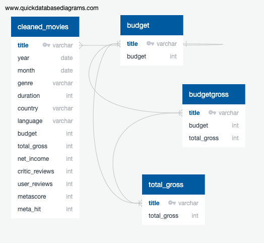
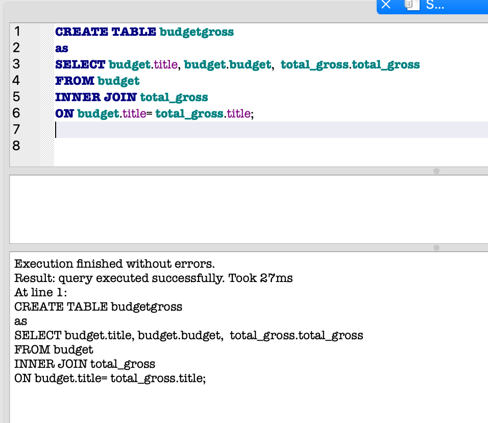
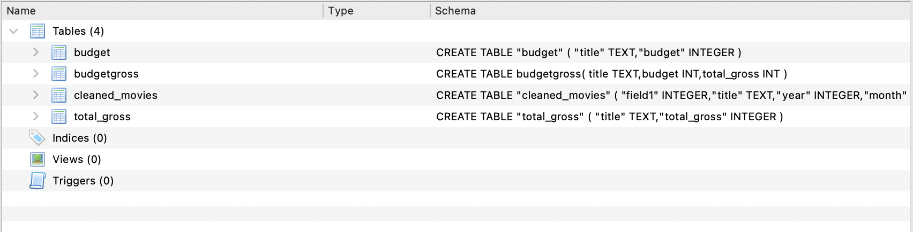

# Hit Movie Project
## Scope
### To use databases and supervised machine learning to predict if a movie will be a hit or not.
Chose this topic because we all enjoy watching movies and prefer movies that are 'hits'.

### Utilized the following items for this “hit movie project".
1.	CSV file from Kaggle - __IMDb movies.csv__
2.	Pandas / Python / Sqlalchemy / Scikit-learn
3.	SQLite to clean and integrate data
4.	Tableau for visualizations and final presentation

### Communication Protocols
* Created a group in Slack with all 4 members to discuss the project.
* Use Zoom when needed to discuss project, share screen and debug code, and also assisting teammates.

### Questions we hope to answer with this analysis
1. Is a movie a hit based on it's metascore?
2. Is a movie a hit based on how much money was grossed?
3. Will a movie be a hit depending on season of the year it was released?

## Database Info:

- SQLite database created using DB Browser for SQLite. The database stores the movie idata we are using in the project, and it is connected to the model by SQAlchemy scripts. 
- The database includes 4 tables, one of which was created by joining two tables together.

## Tableau Dashboard Info:

- Intitial analysis created with interactive dashboard in Tableau
[Tableau dashboard](https://public.tableau.com/app/profile/jeremy.ocain/viz/moviedatav3/WhatmakesaHitMovie?publish=yes)

### Observations:

- Most movies come out in  April, September, March, and October. Profits reflect this same pattern.

- The most critically acclaimed movies come out in March and February and are a combination of Drama, Comedy and Romance.

- The biggest money makers come out in September and October and are a combination of Action, Adventure, Sci-fi, and Comedy. 

- The one month that is significantly different from all the rest is December. The fewest movies are released, but make the hight in profits.
